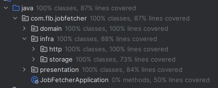

# Job Fetcher

## Prerequisites

- JDK: version 20 (distribution temurin)

## Main commands

### Run the application
```shell
# replace the <change-me> with your own access token
POLE_EMPLOI_API_TOKEN=<change-me> ./gradlew bootTestRun

# to get your own access token execute the following curl command (replace <change-me> with your own data)
curl --location --request POST 'https://entreprise.pole-emploi.fr/connexion/oauth2/access_token?realm=/partenaire' \
--header 'Content-Type: application/x-www-form-urlencoded' \
--data-urlencode 'grant_type=client_credentials' \
--data-urlencode 'client_id=<change-me>' \
--data-urlencode 'client_secret=<change-me>' \
--data-urlencode 'scope=api_offresdemploiv2 o2dsoffre'
```
It will create a postgresql database in a docker container behind the hood. Thanks to Spring Boot 3.1 and Testcontainers ([article](https://www.atomicjar.com/2023/05/spring-boot-3-1-0-testcontainers-for-testing-and-local-development/?utm_source=pocket_saves))

Once the app is started, you can do the synchronization by calling an endpoint. It is described [here](https://github.com/fleboulch/job-fetcher/blob/main/http-samples/sync.http) . If you are using IntelliJ IDE you can run it directly from the file. Check out this [documentation](https://www.jetbrains.com/help/idea/http-client-in-product-code-editor.html) for more details

### Database access
The JDBC url is `jdbc:postgresql://localhost:<port>/job`. The credentials are:
- the port is dynamic by nature (it's how Testcontainers works). It can be found on the logs of the app after the app has been launched. The pattern is `Container is started (JDBC URL: jdbc:postgresql://localhost:<port>/job?loggerLevel=OFF)`
- the username is `admin`
- the password is `change-me`.  
Credentials are defined [here](https://github.com/fleboulch/job-fetcher/blob/main/src/test/java/com/flb/jobfetcher/infra/storage/ContainersConfiguration.java#L16-L17)

### Run the test suite
`./gradlew test` The coverage is 87%



## Information

### Git commits

I write commits as an history so it can help people to understand what the application does.

### Architecture

I'm using hexagonal architecture (with port & adapter pattern). It eases the testing of the app by implementing the ports.

### Testing

I'm using use case driven development. Check out this [great presentation](https://optivem.com/wp-content/uploads/2022/05/Optivem-TDD-and-Clean-Architecture-Use-Case-Driven-Development.pptx.pdf) about this topic. I'm using approach 2 (slide 46).    
I prefer stubs rather than mocks. It eases the refactoring of the code.

### Development methodology

I used real TDD during the development of this project.

### Lombok

Here I'm using lombok but in the real life I'm not a big fan of this library. Some upgrades of lombok can be challenging and sometimes there is conflicts with other libs (for example with Mapstruct). I prefer writing the good old POJOs by myself (with an IDE it's super fast).  

Java records are a good candidate to replace lombok but the fields are immutable by nature and it makes it incompatible with some libraries. That's why I'm using them only in the domain.

### Equals and hashcode on jpa entity

They have been generated using JpaBuddy utility

## Improvements

- Feature: I'm only fetching the first 100 job ads from the Pole Emploi API. I would have to iterate over all the pages.
- Feature: I did not implement the top 10 entreprises
- Security: OAuth2 flow has not been implemented
- Incremental mode is working but it delete all the job ads and then it save them all from the Pole Emploi API. Checking ids can be smarter and more efficient.
